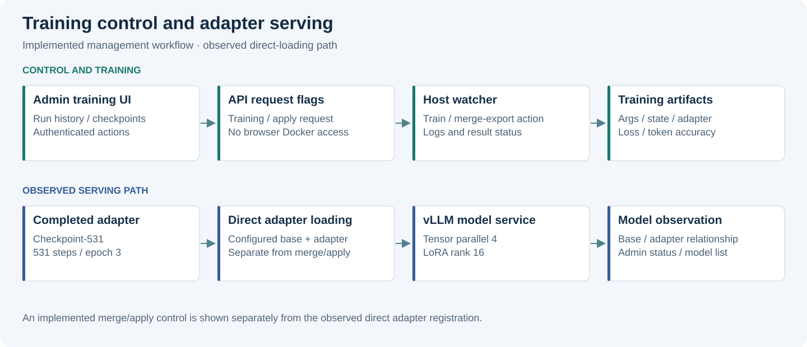
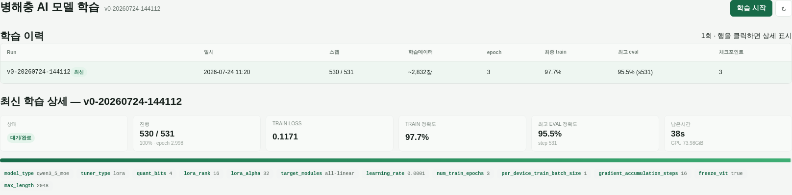
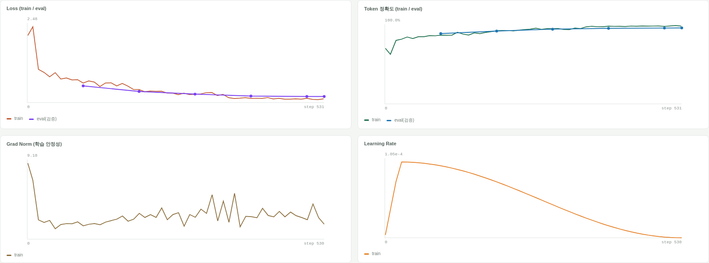
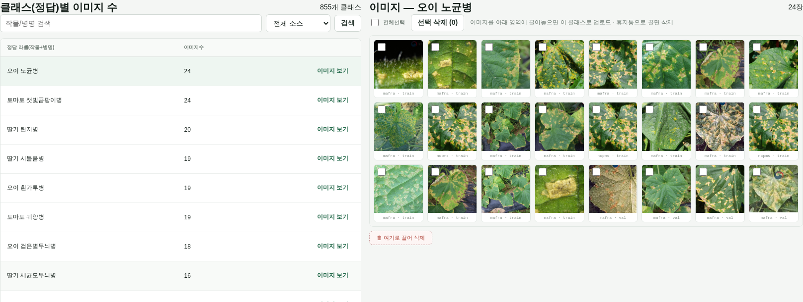
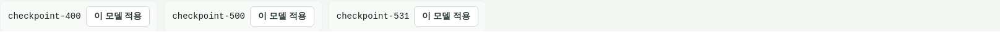
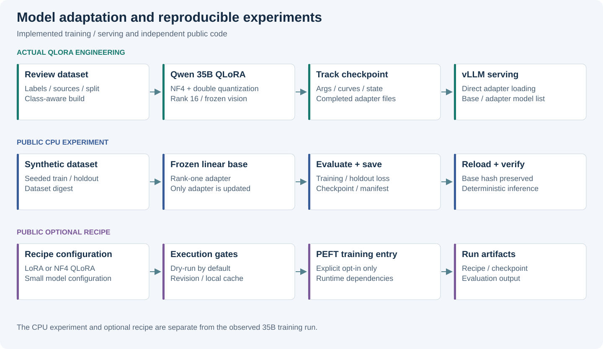

# Efficient Fine-tuning Lab

### Qwen 35B QLoRA · Dataset Curation · Experiment Management · vLLM Serving

[](https://github.com/YeongjoonKim/efficient-finetuning-lab/actions/workflows/ci.yml)

## Actual Engineering Experience

이 프로젝트는 **Model adaptation → Experiment tracking → Serving**을 다룹니다.
실제 35B 학습 근거와 공개 CPU toy 실험을 분리하며, 미확인 revision/hash는
[재현성 목록](docs/reproducibility.md)에 명시합니다.

농업 이미지와 한국어 정답 라벨을 연결하는 데이터셋, **Qwen3.6-35B-A3B의 QLoRA 학습**,
학습 이력·지표·체크포인트 관리, vLLM adapter serving을 구현했습니다.
2026-10-02에 설정·완료 로그·checkpoint·실행 컨테이너·모델 목록을 교차 확인했습니다.

| 실제 확인 항목 | 결과 |
|---|---|
| Base model | **Qwen/Qwen3.6-35B-A3B** — 총 35B, 활성 3B MoE |
| Training | ms-swift · bitsandbytes **4-bit NF4 + double quantization** · bfloat16 compute |
| Adapter | LoRA rank 16 / alpha 32 · all-linear · vision encoder frozen |
| Completed run | 3 epochs · **531 / 531 steps** · checkpoint-531 |
| Final evaluation | loss **0.19017857**, token accuracy **0.95468998** |
| Serving | vLLM · tensor parallel 4 · rank 16 adapter · 모델 목록에서 adapter 확인 |

Token accuracy는 정답 시퀀스의 토큰 단위 지표이며 진단 정확도와 구분합니다.
[상세 근거와 지표 정의](docs/actual-engineering.md).

## Training & Serving Architecture



공공 이미지 / 검수된 수집분 → 클래스별 데이터셋 → QLoRA → 지표·checkpoint
→ adapter loading → vLLM → 이미지 모델을 사용하는 애플리케이션.

학습 watcher에 데이터셋 재구성·작업 상태 관리·모델 적용 경로를 연결했습니다.
현재 serving은 **checkpoint-531 직접 adapter loading**입니다.
merge 후 적용 경로도 구현되어 있으며 현재 사용 경로와 구분해 설명합니다.

## Training Monitoring

**Purpose** — 실행별 설정과 진행 상태를 같은 화면에서 확인합니다.



**What this demonstrates** — 실행 이력, train/eval 지표, hyperparameter 조회가 실제 학습 산출물에 연결됩니다.
화면은 마지막 train 로그인 530 step을 표시하고 완료는 trainer state의 531 step으로 확인했습니다.
**Architecture relation** — Training → Experiment Tracking.

### Training Curves

**Purpose** — loss·token accuracy·gradient norm·learning rate로 학습 진행을 관찰합니다.



**What this demonstrates** — 저장된 train/eval 로그의 네 가지 그래프.
**Architecture relation** — Training → Monitoring → Checkpoint selection.

## Dataset Acquisition & Curation

공공 병해충 이미지·온실 이미지·관리자 업로드·외부 수집 staging을 공통 학습 형식으로 연결했습니다.
외부 수집은 중복 검사·라벨 검토·승인·commit을 거쳐 다음 데이터셋 빌드에 반영됩니다.

캡처 시점 활성 데이터셋은 **train 2,822 / validation 135 / 855 labels**입니다.
외부 수집분 **4,520장은 다음 빌드 대기**이며 완료된 학습의 사용량에 더하지 않습니다.

**Purpose** — 정답 라벨별 수량과 이미지를 함께 보며 불균형·라벨 오류를 검토합니다.



**What this demonstrates** — 클래스 검색, 소스 필터, 선택 라벨의 이미지·split drill-down.
**Architecture relation** — Acquisition → Curation → Dataset.

## Checkpoint Management

**Purpose** — 저장된 adapter를 실행 이력과 연결해 선택합니다.



**What this demonstrates** — checkpoint-400 / 500 / 531과 모델 적용 인터페이스.
이번 검토에서는 조회만 수행했으며 학습·모델 교체는 실행하지 않았습니다.
**Architecture relation** — Training artifact → Deployment decision → Serving.

## System Strengths

| Decision | 구현 효과 |
|---|---|
| Dataset visibility | 정답 라벨·출처·split·이미지를 한 흐름에서 검토 |
| Experiment traceability | args, step별 로그, trainer state, adapter를 실행 단위로 연결 |
| Parameter-efficient training | quantized base와 학습 가능한 adapter의 역할 분리 |
| Adapter lifecycle | 학습 완료와 실제 serving model 목록을 각각 확인 |

## Public Reference Implementation & Lightweight Demo

| 구분 | 공개 범위 |
|---|---|
| Actual Engineering Experience | 위 Qwen 35B 학습·운영 UI·서빙 관측 |
| Public Reference Implementation | 선택형 PEFT LoRA / NF4 QLoRA recipe와 실행 gate |
| Public Lightweight Demo | CPU rank-one 실험, frozen base hash, checkpoint, holdout |



CPU 예제는 train 24 / holdout 12의 합성 데이터로 adapter 업데이트를 빠르게 확인합니다.
[실행 artifact](examples/execution.json)의 holdout MSE는 0.01621627 → 0.01428599입니다.
선택형 recipe의 Qwen2.5-0.5B는 **공개 재현용 후보**이며 실제 35B 학습 모델과 별개입니다.

## Experiment Tracking & Reproducibility

Python 3.10+ 표준 라이브러리로 기본 예제를 실행합니다.

```sh
python3 -m src.toy_lora
python3 -m src.export_evidence
python3 -m src.optional_peft --mode qlora
python3 -m unittest discover -s tests -v
python3 scripts/check_repository.py
```

선택형 PEFT 명령은 기본 dry-run입니다. 실제 실행에는 고정 revision·로컬 cache·의존성·사용권·GPU 확인이 필요합니다.
19개 테스트는 frozen base, checkpoint, split, 실행 gate와 artifact 재계산을 검증합니다.

## Scope & Limitations

실제 학습 가중치·원천 데이터·회사 소스는 공개하지 않습니다.
CPU sample의 uniform 4-bit proxy는 설명용이며 실제 NF4 학습과 별개입니다.
현재 dataset 조회값은 캡처 시점의 상태로 완료 run의 불변 snapshot을 대신하지 않습니다.
독립 이미지 holdout, 희소 클래스의 검증 coverage, revision 고정,
자원 프로파일과 failure case 비교를 다음 평가 과제로 남깁니다.

[상세 근거](docs/actual-engineering.md) · [평가](docs/evaluation.md) ·
[검증 기록](docs/validation.md) · [공개 경계](PUBLICATION.md) ·
[License notice](LICENSE-NOTICE.md) · [Security](SECURITY.md).
